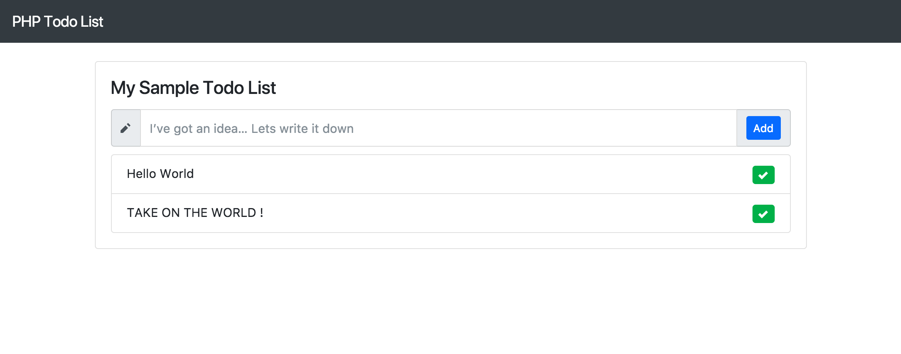

# Fake Todo PHP « sample code »

The only purpose of this sample « website » is to illustrate a course (Add VueJS to a legacy app).

This is the VueJS version of the course.

Take it as is.

## Quick look

## Whats inside

- VueJS 2
- Bootstrap 4.
- No databases (use $_SESSION to make the sample simpler).
- htmlpurifier to limit the XSS.
- Sets of actions in the actions folder.
- Template librairie.
- Open-Iconic.
